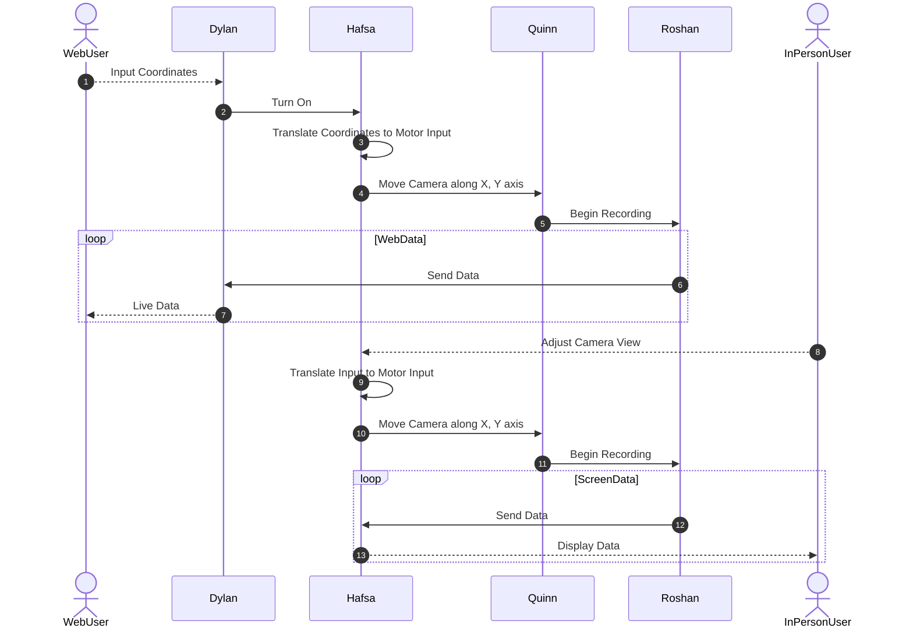

## Team Block Diagram

## Communication Sequence

## Message Structure

| Message Type byte 1-2 (uint16_t) | Description |
| -------------------------------------- | ----------- |
| 1                                      | x           |
