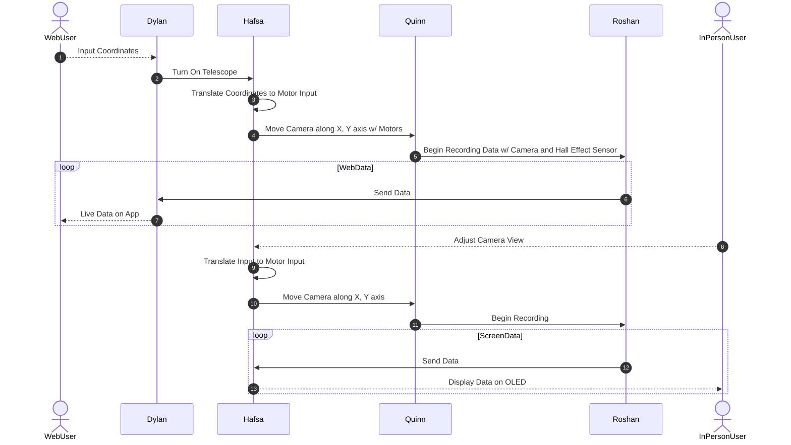

## Team Block Diagram

## Communication Sequence

## Message Structure

| Message Type byte 1-2 (uint16_t) | Description                               |
| -------------------------------------- | ----------------------------------------- |
| 1                                      | Set Data Receiver to Web or In-person     |
| 2                                      | Translate Coordinate Input to Motor Input |
| 3                                      | Power Button Pushed |
| 4 | sub |
| 5 | |
| 6 | |
| 7 | |
| 8 | |
| 9 | |
| 10 | |
| 11 | |
| 12 | |
| 13 | |

Message Type 1:

| Byte 1-2 (uint16_t) | Byte 3 (uint8_t)   |
| ------------------- | ------------------ |
| 1                   | UserMode (uint8_t) |

Message Type 2:

| Byte 1-2 (uint16_t) | Byte 3 (uint8_t) | Byte 4-5 (uint16_t) |
| ------------------- | ---------------- | ------------------- |
| 2                   | X (uint8_t)      | Y (uint16_t)        |

Message Type 3:

| Byte 1-2 (uint16_t) | Byte 3 (uint8_t)  |
| ------------------- | ----------------- |
| 3                   | Button1 (uint8_t) |

Message Type 4:

| Byte 1-2 (uint16_t) | Byte 3-58 (char) |
| ------------------- | ---------------- |
| 4                   | string           |
