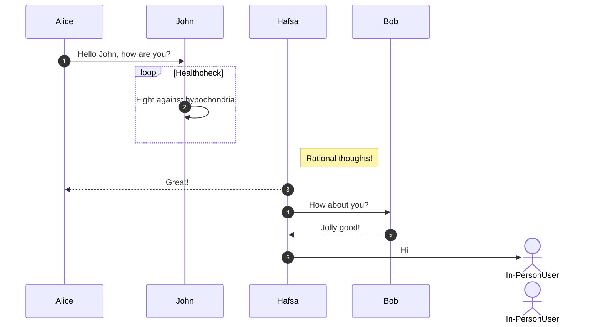

## Team Block Diagram

## Communication Sequence

## Message Structure

---
config:
  packet:
    bitsPerRow: 16
    bitWidth: 64
---
packet-beta
title Message
0: "0x41"
1: "0x5a"
2: "Source ID"
3: "Dest ID"
4-61: "Message (Variable Length <= 58 Bytes)"
62: "0x59"
63: "0x42"
