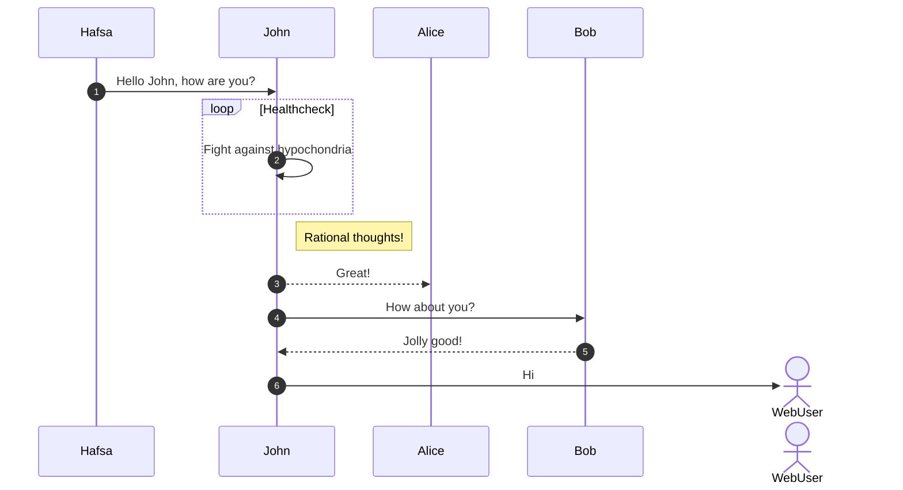

## Team Block Diagram

## Communication Sequence

``` mermaid
sequenceDiagram
  autonumber
  Hafsa->>John: Hello John, how are you?
  loop Healthcheck
      John->>John: Fight against hypochondria
  end
  Note right of John: Rational thoughts!
  John-->>Alice: Great!
  John->>Bob: How about you?
  Bob-->>John: Jolly good!
  create actor W as WebUser
  John->>W: Hi
```
