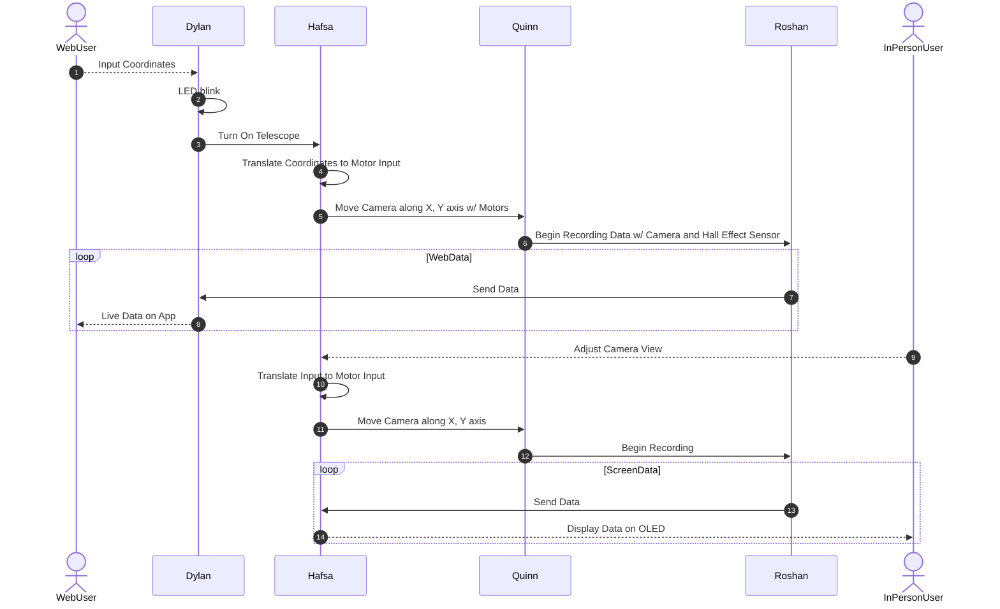

## Team Block Diagram

## Communication Sequence

## Message Structure

| Message Type byte 1-2 (uint16_t) | Description                                   |
| -------------------------------------- | --------------------------------------------- |
| 1                                      | WiFi Signal Received                          |
| 2                                      | Set Data Receiver Type (Web or In-person)     |
| 3                                      | Print User Input                              |
| 4                                      | Translate Coordinate Input to Motor Input     |
| 5                                      | Translate Potentiometer inputs to Motor Input |
| 6                                      | Power Button Pushed                           |
| 7                                      | Set Motor X, Y                                |
| 8                                      | Set Roshan subsystem to On/Off                |
| 9                                      | Transmit Compressed Video                     |
| 10                                     | Transmit Hall Effect Data                     |
| 11                                     | Display hall effect data                      |
| 12                                     | Display video data                            |

Message Type 1:

| Byte 1-2 (uint16_t) | Byte 3 (uint8_t) |
| ------------------- | ---------------- |
| 01                  | wifi (bool)      |

Message Type 2:

| Byte 1-2 (uint16_t) | Byte 3-58 (char)   |
| ------------------- | ------------------ |
| 02                  | string             |

Message Type 3:

| Byte 1-2 (uint16_t) | Byte 3-58 (char) |
| ------------------- | ---------------- |
| 03                  | string           |

Message Type 4:

| Byte 1-2 (uint16_t) | Byte 3 (uint8_t) | Byte 4-5 (uint16_t) |
| ------------------- | ---------------- | ------------------- |
| 04                  | X (uint8_t)      | Y (uint16_t)        |

Message Type 5:

| Byte 1-2 (uint16_t) | Byte 3 (uint8_t) | Byte 4-5 (uint16_t) |
| ------------------- | ---------------- | ------------------- |
| 05                  | X (uint8_t)      | Y (uint16_t)        |

Message Type 6:

| Byte 1-2 (uint16_t) | Byte 3 (uint8_t)  |
| ------------------- | ----------------- |
| 06                  | Button (bool)     |

Message Type 7:

| Byte 1-2 (uint16_t) | Byte 3 (uint8_t) | Byte 4-5 (uint16_t) |
| ------------------- | ---------------- | ------------------- |
| 07                  | X (uint8_t)      | Y (uint16_t)        |

Message Type 8:

| Byte 1-2 (uint16_t) | Byte 3 (uint8_t) | Byte 4-5 (uint16_t) |
| ------------------- | ---------------- | ------------------- |
| 08                  | X (uint8_t)      | Y (uint16_t)        |

Message Type 9:

| Byte 1-2 (uint16_t) | Byte 3 (uint8_t) | Byte 4-5 (uint16_t) |
| ------------------- | ---------------- | ------------------- |
| 09                  | X (uint8_t)      | Y (uint16_t)        |

Message Type 10:

| Byte 1-2 (uint16_t) | Byte 3 (uint8_t) | Byte 4-5 (uint16_t) |
| ------------------- | ---------------- | ------------------- |
| 10                  | X (uint8_t)      | Y (uint16_t)        |

Message Type 11:

| Byte 1-2 (uint16_t) | Byte 3 (uint8_t) | Byte 4-5 (uint16_t) |
| ------------------- | ---------------- | ------------------- |
| 10                  | X (uint8_t)      | Y (uint16_t)        |

Message Type 12:

| Byte 1-2 (uint16_t) | Byte 3 (uint8_t) | Byte 4-5 (uint16_t) |
| ------------------- | ---------------- | ------------------- |
| 10                  | X (uint8_t)      | Y (uint16_t)        |
