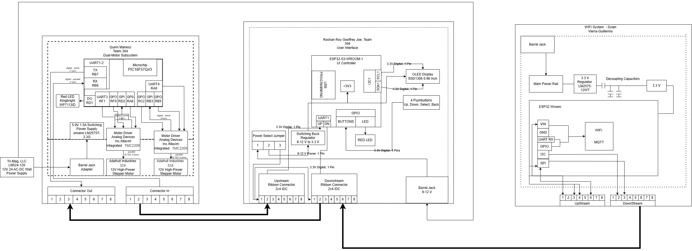
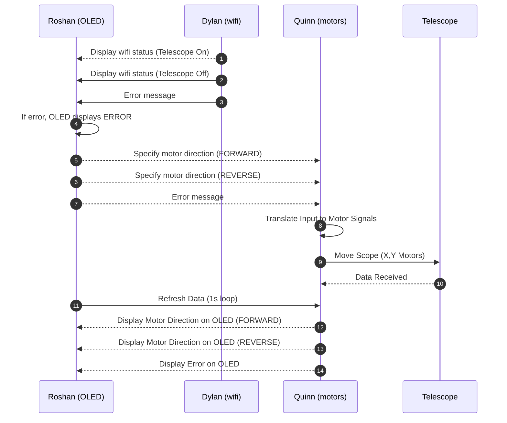

## Team Block Diagram

**Figure 1**: Subsystem PCBs and Connections, PDF version [*here*](image/314-Team304-TeamBlockDiagramfinal.drawio.pdf)

We decided to create our block diagram as above specifically so as to keep communication between subsystems as simple as possible. Included in the block diagram are the necessary UART connections, wireless connections, actuators, as well as a human-machine interface, as required by the project. The motor subsystem is the main feature of the current product, so it functions as a sort of defacto master subsystem, and is therefore centered in the diagram.

## Communication Sequence

``` mermaid
sequenceDiagram
  autonumber


  participant Roshan (OLED)
  participant Dylan (wifi)
  participant Quinn (motors)
  participant Telescope

  Dylan (wifi)-->>Roshan (OLED): Display wifi status (Telescope On) 
  Dylan (wifi)->>Roshan (OLED): Display wifi status (Telescope Off)
  Dylan (wifi)->>Roshan (OLED): Error message
  Roshan (OLED)->>Roshan (OLED): If error, OLED displays ERROR

  Roshan (OLED)-->>Quinn (motors): Specify motor direction (FORWARD)
  Roshan (OLED)-->>Quinn (motors): Specify motor direction (REVERSE)
  Roshan (OLED)-->>Quinn (motors): Error message
  Quinn (motors)->>Quinn (motors): Translate Input to Motor Signals
  Quinn (motors)->>Telescope: Move Scope (X,Y Motors)


  Telescope-->>Quinn (motors): Data Received
  Roshan (OLED)->>Quinn (motors): Refresh Data (1s loop)
  Quinn (motors)-->>Roshan (OLED): Display Motor Direction on OLED (FORWARD)
  Quinn (motors)-->>Roshan (OLED): Display Motor Direction on OLED (REVERSE)
  Quinn (motors)-->>Roshan (OLED): Display Error on OLED
```
The communication sequence diagram illustrates how information flows between the OLED interface (Roshan), WiFi subsystem (Dylan), motor control subsystem (Quinn), and the telescope. This sequence directly satisfies user needs by ensuring that system status, control inputs, and feedback are processed in a clear and reliable order.

From the diagram, the system first prioritizes WiFi status updates (steps 1–3), which are immediately displayed on the OLED. This satisfies the user requirement of real-time system awareness. If an error occurs (step 4), the OLED displays an error message instead of allowing further operation, ensuring safe system behavior.

User commands such as motor direction (steps 5–6) are transmitted to the motor subsystem, which then translates these inputs into physical motor signals (step 8). The telescope responds by moving accordingly (step 9), and confirmation data is returned (step 10). This closed-loop interaction ensures that user inputs result in correct physical behavior, fulfilling functional requirements.

Finally, the system continuously refreshes data (step 11) and updates the OLED with motor direction or error states (steps 12–14). This continuous feedback loop ensures the user is always informed of system status, improving usability and reliability.

## Message Structure

| Message Type byte 1-2 (uint16_t) | Description                                   |
| -------------------------------------- | --------------------------------------------- |
| 1                                      | WiFi Signal Received                          |
| 2                                      | Set Data Receiver Type (Web or In-person)     |
| 3                                      | Print User Input                              |
| 4                                      | Translate Coordinate Input to Motor Input     |
| 6                                      | Power Button Pushed                           |
| 7                                      | Set Motor X, Y                                |
| 8                                      | Set Roshan subsystem to On/Off                |

Message Type 1:

| Byte 1-2 (uint16_t) | Byte 3 (uint8_t) |
| ------------------- | ---------------- |
| 01                  | wifi (bool)      |

Message Type 2:

| Byte 1-2 (uint16_t) | Byte 3-58 (char)   |
| ------------------- | ------------------ |
| 02                  | string             |

Message Type 3:

| Byte 1-2 (uint16_t) | Byte 3-58 (char) |
| ------------------- | ---------------- |
| 03                  | string           |

Message Type 4:

| Byte 1-2 (uint16_t) | Byte 3 (uint8_t) | Byte 4-5 (uint16_t) |
| ------------------- | ---------------- | ------------------- |
| 04                  | X (uint8_t)      | Y (uint16_t)        |

Message Type 5:

| Byte 1-2 (uint16_t) | Byte 3 (uint8_t) | Byte 4-5 (uint16_t) |
| ------------------- | ---------------- | ------------------- |
| 05                  | X (uint8_t)      | Y (uint16_t)        |

Message Type 6:

| Byte 1-2 (uint16_t) | Byte 3 (uint8_t)  |
| ------------------- | ----------------- |
| 06                  | Button (bool)     |

Message Type 7:

| Byte 1-2 (uint16_t) | Byte 3 (uint8_t) | Byte 4-5 (uint16_t) |
| ------------------- | ---------------- | ------------------- |
| 07                  | X (uint8_t)      | Y (uint16_t)        |

Message Type 8:

| Byte 1-2 (uint16_t) | Byte 3 (uint8_t)         |
| ------------------- | ------------------------ |
| 08                  | subsystemState (bool)    |

---

## Message Structure Design and Decision Process

The team initially selected a simple message format using "AZ" as a start identifier and "BY" as an end identifier. This decision was made to simplify early development and ensure all subsystems could communicate quickly without complex parsing.

However, as shown in the sequence diagram, multiple types of messages are exchanged, including WiFi status, motor commands, and error messages. This required the team to refine the structure to include identifiable payloads within the message, allowing each subsystem to interpret commands correctly.

The team chose to maintain a lightweight protocol rather than adopting a fully complex structure to avoid increasing software overhead. Instead, message meaning is determined by keywords such as "FORWARD", "REVERSE", or "ERROR", as seen in steps 5–7 and 12–14 of the diagram. This approach balances simplicity with functionality while still allowing clear communication between subsystems.

The decision-making process focused on three priorities:
- Ensuring compatibility across all subsystems
- Minimizing processing complexity on microcontrollers
- Allowing future expansion of commands without redesigning the entire system

---

## Top 5 Software Design Changes Since Proposal

1. **Addition of WiFi Dependency for System Operation**

   In the original proposal, motor control could occur independently of WiFi status. This posed a risk of unintended operation. As shown in steps 1–4 of the sequence diagram, WiFi status is now checked first, and the system only proceeds if a valid connection is confirmed. This change improves system safety and ensures proper operation conditions.

2. **Implementation of Error Handling and Safe State Behavior**

   Initially, the system did not properly handle invalid or unexpected messages. This led to potential system instability. The updated design includes explicit error message handling (steps 3–4 and 14), where the OLED displays an error and prevents further action. This ensures the system enters a safe state instead of executing unintended commands.

3. **Refinement of Message Interpretation Logic**

   Early versions of the software relied on minimal parsing, making it difficult to distinguish between different command types. The updated design uses keyword-based interpretation (e.g., FORWARD, REVERSE, ERROR), as shown in steps 5–7. This allows the system to correctly route commands to the appropriate subsystem and improves communication clarity.

4. **Closed-Loop Feedback Integration**

   The original design did not include confirmation that commands were successfully executed. In the updated version, the motor subsystem sends feedback after processing commands (steps 9–10), which is then reflected back to the OLED (steps 12–13). This closed-loop system improves reliability by ensuring actions are verified before being displayed to the user.

5. **Continuous Data Refresh and Display Updates**

   Previously, the system updated outputs only when new input was received. This caused inconsistent display behavior. The updated design introduces a periodic refresh loop (step 11), ensuring the OLED always reflects the current system state. This improves user experience and aligns with real-time system requirements.

---