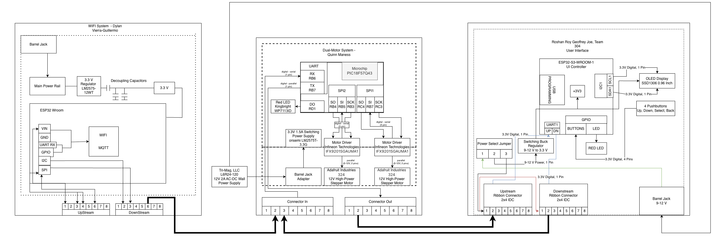
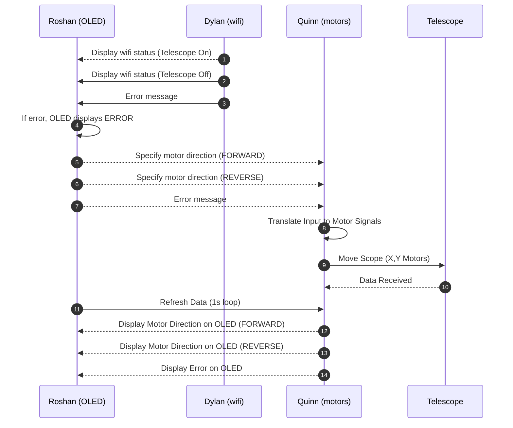

## Team Block Diagram

**Figure 1**: Subsystem PCBs and Connections, PDF version [*here*](https://github.com/user-attachments/files/25704085/314-Team304-TeamBlockDiagram.drawio.pdf)

We decided to create our block diagram as above specifically so as to keep communication between subsystems as simple as possible. Included in the block diagram are the necessary UART connections, wireless connections, actuators, as well as a human-machine interface, as required by the project. The motor subsystem is the main feature of the current product, so it functions as a sort of defacto master subsystem, and is therefore centered in the diagram.

## Communication Sequence

``` mermaid
sequenceDiagram
  autonumber


  participant Roshan (OLED)
  participant Dylan (wifi)
  participant Quinn (motors)
  participant Telescope

  Dylan (wifi)-->>Roshan (OLED): Display wifi status (Telescope On) 
  Dylan (wifi)->>Roshan (OLED): Display wifi status (Telescope Off)
  Dylan (wifi)->>Roshan (OLED): Error message
  Roshan (OLED)->>Roshan (OLED): If error, OLED displays ERROR

  Roshan (OLED)-->>Quinn (motors): Specify motor direction (FORWARD)
  Roshan (OLED)-->>Quinn (motors): Specify motor direction (REVERSE)
  Roshan (OLED)-->>Quinn (motors): Error message
  Quinn (motors)->>Quinn (motors): Translate Input to Motor Signals
  Quinn (motors)->>Telescope: Move Scope (X,Y Motors)


  Telescope-->>Quinn (motors): Data Received
  Roshan (OLED)->>Quinn (motors): Refresh Data (1s loop)
  Quinn (motors)-->>Roshan (OLED): Display Motor Direction on OLED (FORWARD)
  Quinn (motors)-->>Roshan (OLED): Display Motor Direction on OLED (REVERSE)
  Quinn (motors)-->>Roshan (OLED): Display Error on OLED
```
This communication sequence effectively satisfies the users needs and product requirements by providing a reliable, efficient, and linear path for the user to communicate what they need to the HMI, and thereafter convert that need into motor movements and ideally data collection. It's a simple system--assuming that the user is familiar with the product and its uses. It senses wifi connection, and only allows for HMI to motor communication in the case that wifi is acquired, as data collection without MQTT would simply result in lost data.

## Message Structure

| Message Type byte 1-2 (uint16_t) | Description                                   |
| -------------------------------------- | --------------------------------------------- |
| 1                                      | WiFi Signal Received                          |
| 2                                      | Set Data Receiver Type (Web or In-person)     |
| 3                                      | Print User Input                              |
| 4                                      | Translate Coordinate Input to Motor Input     |
| 6                                      | Power Button Pushed                           |
| 7                                      | Set Motor X, Y                                |
| 8                                      | Set Roshan subsystem to On/Off                |

Message Type 1:

| Byte 1-2 (uint16_t) | Byte 3 (uint8_t) |
| ------------------- | ---------------- |
| 01                  | wifi (bool)      |

Message Type 2:

| Byte 1-2 (uint16_t) | Byte 3-58 (char)   |
| ------------------- | ------------------ |
| 02                  | string             |

Message Type 3:

| Byte 1-2 (uint16_t) | Byte 3-58 (char) |
| ------------------- | ---------------- |
| 03                  | string           |

Message Type 4:

| Byte 1-2 (uint16_t) | Byte 3 (uint8_t) | Byte 4-5 (uint16_t) |
| ------------------- | ---------------- | ------------------- |
| 04                  | X (uint8_t)      | Y (uint16_t)        |

Message Type 5:

| Byte 1-2 (uint16_t) | Byte 3 (uint8_t) | Byte 4-5 (uint16_t) |
| ------------------- | ---------------- | ------------------- |
| 05                  | X (uint8_t)      | Y (uint16_t)        |

Message Type 6:

| Byte 1-2 (uint16_t) | Byte 3 (uint8_t)  |
| ------------------- | ----------------- |
| 06                  | Button (bool)     |

Message Type 7:

| Byte 1-2 (uint16_t) | Byte 3 (uint8_t) | Byte 4-5 (uint16_t) |
| ------------------- | ---------------- | ------------------- |
| 07                  | X (uint8_t)      | Y (uint16_t)        |

Message Type 8:

| Byte 1-2 (uint16_t) | Byte 3 (uint8_t)         |
| ------------------- | ------------------------ |
| 08                  | subsystemState (bool)    |
